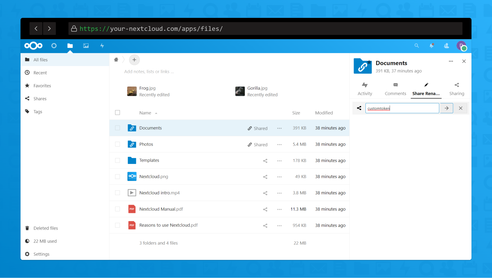

[](https://www.somsubhra.com/github-release-stats/?username=DecaTec&repository=sharerenamer)
[](https://github.com/DecaTec/sharerenamer/blob/master/LICENSE)

# ShareRenamer
## A simple share link renamer add-in for the Files app in Nextcloud



This is an add-in to the Files app, which allows you to customize your share tokens, so your links can be https://mycloud.de/s/mysharedlink instead of https://mycloud.de/s/qPv1SwbU5M2YEoJZ. Just share a file or folder (or click an already shared one) and a new button for renaming the link will appear below the share link URL in the sidebar of the Files app. 

You can also rename links in the Gallery app.

Please be aware that this is a potential security risk: links could be guessed! We discourage using this app on large instances that host sensitive data! We also encourage you to password protect such shared links.

## Requirements
* Nextcloud >= 9

## Install
### Nextcloud app store
Just install the app from the [Nextcloud app store](https://apps.nextcloud.com/apps/sharerenamer). It can be found under the 'tools' category.

### Manual installation
* Download the latest version from the [release page](https://github.com/DecaTec/sharerenamer/releases).
* Extract the archive to your Nextcloud's app folder, e.g. `tar xvf sharerenamer-x.x.x.tar.gz -C /path/to/nextcloud/apps`
* Enable the app in the Apps section of your Nextcloud.

### Install from git
* Simply clone the repo to your apps folder:
```
cd /path/to/nextcloud/apps/
git clone https://github.com/DecaTec/sharerenamer.git
```
* Enable the app in the Apps section of your Nextcloud.
