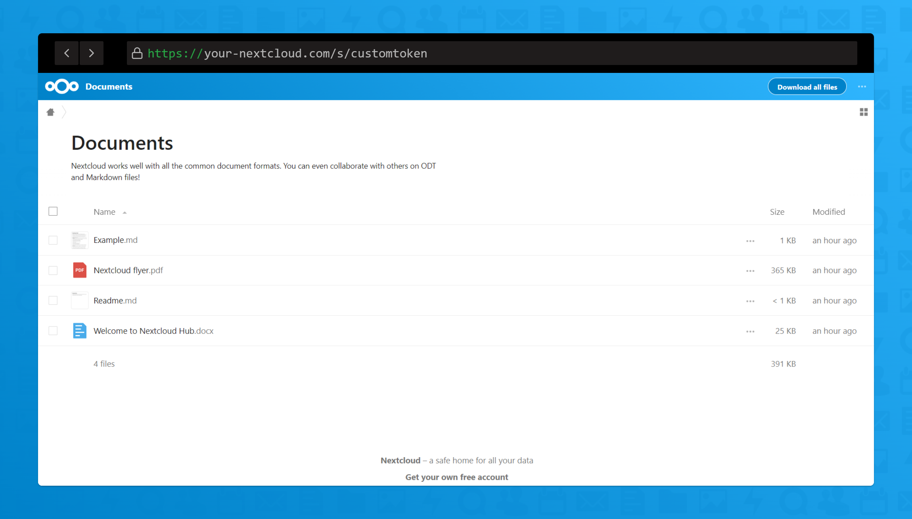

[](https://github.com/JonathanTreffler/sharerenamer/releases)
[](https://github.com/JonathanTreffler/sharerenamer/blob/master/LICENSE)
[](https://stand-with-ukraine.pp.ua)

# ShareRenamer

This Nextcloud app allows you to customize your share tokens, so your links can be like https://your-nextcloud.com/s/mysharedlink instead of https://your-nextcloud.com/s/qPv1SwbU5M2YEoJZ. Just share a file or folder normally and customize the link in the sharerenamer tab in the sidebar.

## A simple Nextcloud app that lets you customize file/folder share links




## Requirements
* Nextcloud 22 - 23

## Installation
### Nextcloud app store (*recommended*)
Just install the app from the [Nextcloud app store](https://apps.nextcloud.com/apps/sharerenamer). It can be found under the 'tools' category.

### Manual installation
* Download the latest version from the [release page](https://github.com/JonathanTreffler/sharerenamer/releases).
* Extract the archive to your Nextcloud's app folder, e.g. `tar xvf sharerenamer-x.x.x.tar.gz -C /path/to/nextcloud/apps`
* Enable the app in the Apps section of your Nextcloud.

### Install from git
* Simply clone the repo to your apps folder and build the frontend:
```
cd /path/to/nextcloud/apps/
git clone https://github.com/JonathanTreffler/sharerenamer.git
cd sharerenamer/
make composer
make npm-init
make build-js-production
```
* Enable the app in the Apps section of your Nextcloud.

## Security
- Share Tokens can currently not be set to the same string as any registered username, so do not use this app if users are not supposed to be able to find out any other registered usernames.
- Links could be guessed! We discourage using this app on large instances that host sensitive data! We also encourage you to password protect such shared links.

## Known Issues:
- Changes to the link shares only show up in the Sharerenamer Tab after the sidebar has been closed and opened again
- The copy button of the Shares tab only copies the new link after the sidebar has been closed and opened again

(please don't create issue for these)

## Development
[](https://gitpod.io/#https://github.com/JonathanTreffler/sharerenamer/)

It will automatically spin up and configure a full Nextcloud, MariaDB and PhpMyAdmin server.

### Nextcloud Login:
**Username:** dev

**Password:** t2qQ1C6ktYUv7

### PhpMyAdmin Login:
**Username:** nextcloud

**Password:** wdGq73jQB0p373gLdf6yLRj5

### OCC
```bash
docker exec -it -u 33 gitpod_app_1 php occ
```

(It is fine to have these static logins, because gitpod has acess control built in and no sensitive data is stored in these dev servers)

## Creating a new Release

Steps:
1. Place appstore private key at $HOME/.nextcloud/certificates/sharerenamer.key (/home/gitpod/.nextcloud/certificates/sharerenamer.key for gitpod)
1. `krankerl login --appstore <appstore api key>`
1. `krankerl package`
1. `krankerl sign --package`
1. Create a new Github release and attach the build/artifacts/sharerenamer.tar.gz file
1. `krankerl publish <github release attached file public url>`